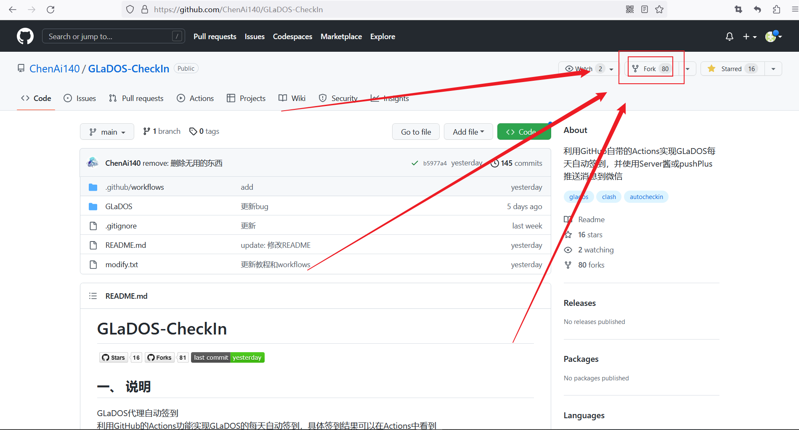
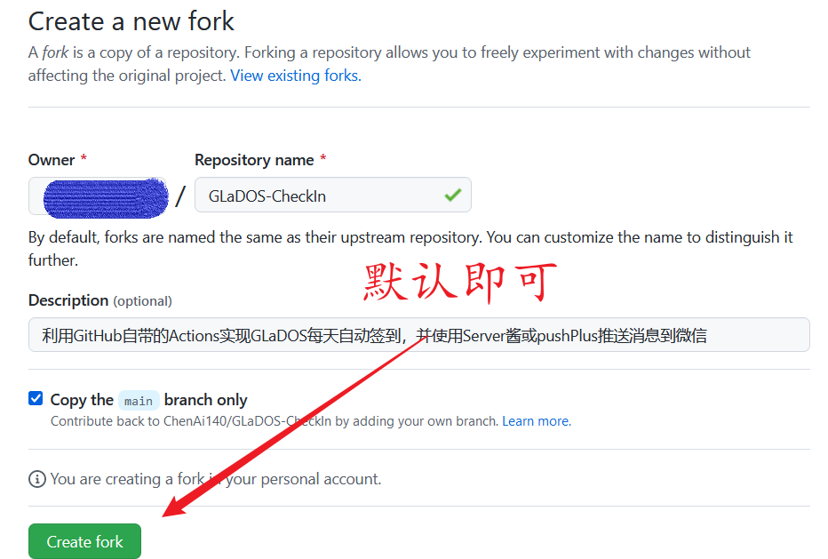
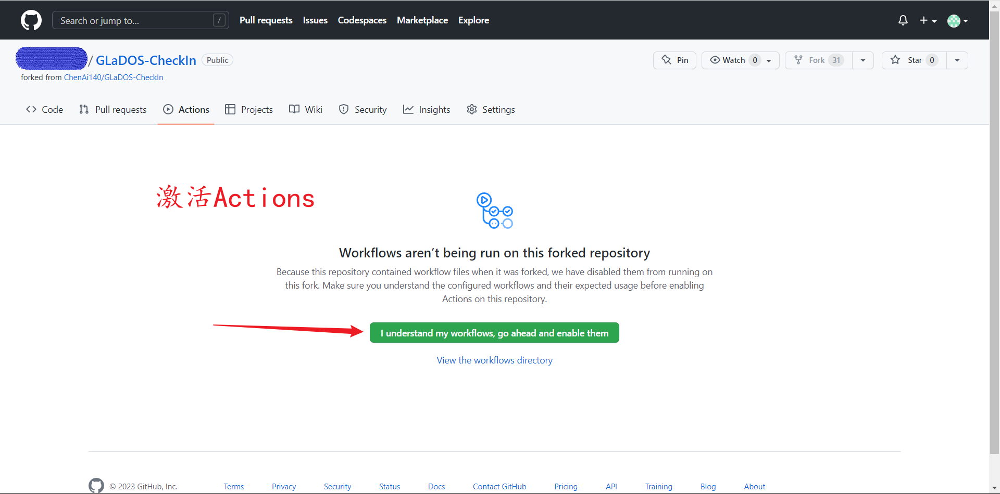
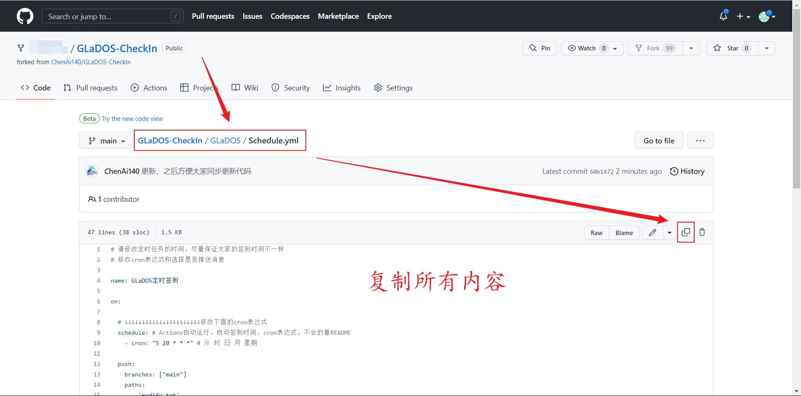
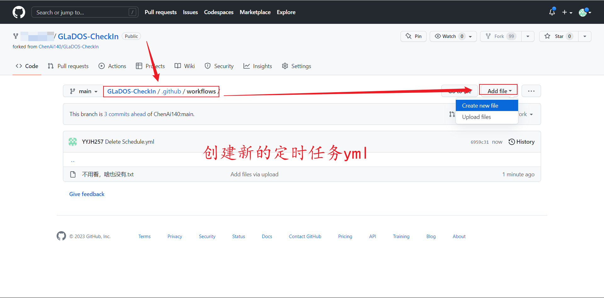
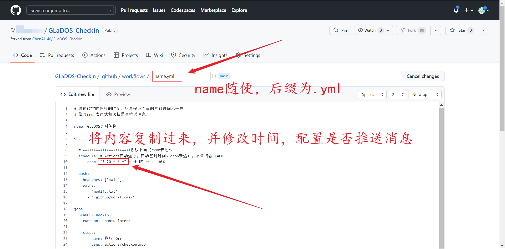
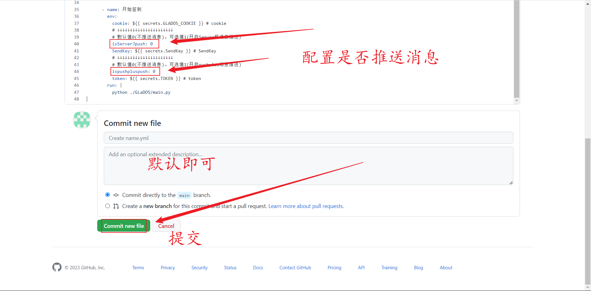
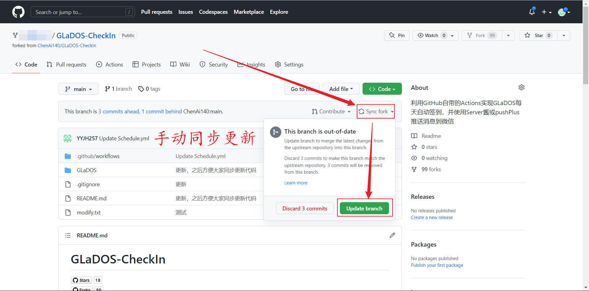
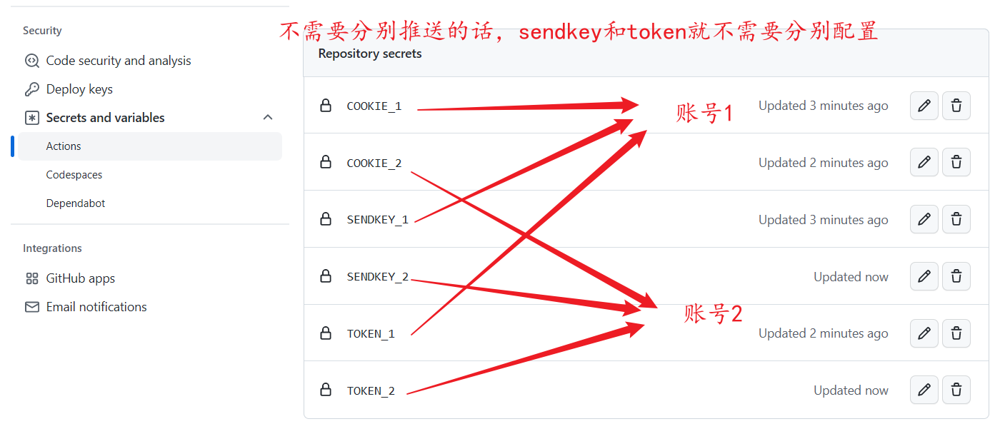
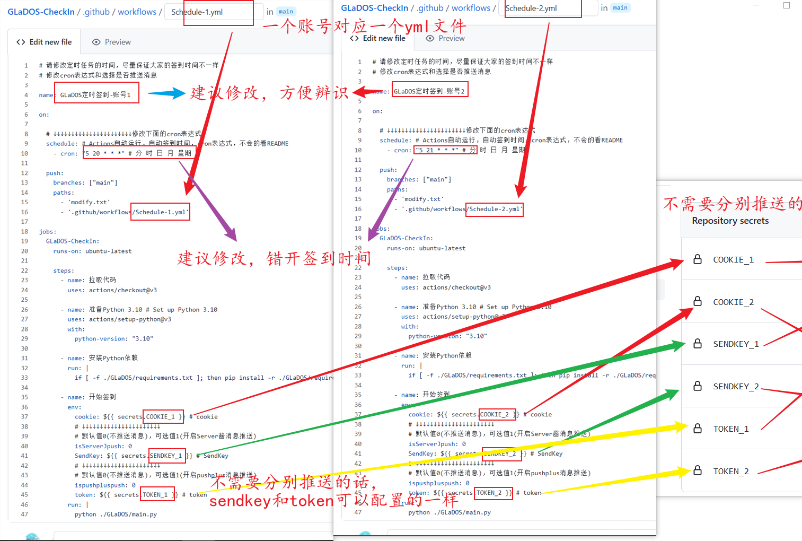

# <font color="red">GLaDOS-CheckIn</font>

  
  
  

## 一、 说明

GLaDOS代理自动签到  
利用GitHub的Actions功能实现GLaDOS的每天自动签到，具体签到结果可以在Actions中看到  
利用[Server酱](https://sct.ftqq.com/)或者[pushPlus](https://www.pushplus.plus/)将签到结果推送到微信  

```bash
# 仓库地址
https://github.com/ChenAi140/GLaDOS-CheckIn
```
每天 <font color="red">20:05</font> 开始排队签到，具体签到时间以GitHub延迟为准，大概延迟8h+    
建议大家自行修改一个时间点，防止意外  
如需修改签到时间[点击此处](./.github/workflows/)，打开文档，自行修改cron表达式，不会看这里 [Cron表达式](https://help.aliyun.com/document_detail/64769.html)  

如有疑问，请提交 Issues  

## 二、 注册GLaDOS

[GLaDOS注册入口](https://github.com/glados-network/GLaDOS)  

我的邀请码：AZDOF-3654G-EBHR4-O79MD  
填写邀请码双方互利  
工具推荐使用Clash  
[Clash for Windows](https://github.com/Fndroid/clash_for_windows_pkg/tags)  --->  [汉化补丁，可能有广告](https://github.com/BoyceLig/Clash_Chinese_Patch)  
[Clash for Android](https://github.com/Kr328/ClashForAndroid/tags)  

## 三、 自动签到教程


1. Fork此仓库  
    <details><summary>点击此处展开</summary><pre>
    点击右上角的 Fork 按钮
        <br/>
    点击 Create fork ，然后等待仓库创建成功
        
    </pre> </details>

2. 注册GLaDOS，并获取cookie  
    <details><summary>点击此处展开</summary><pre>
    注册GLaDOS：略    
    获取cookie
        
    </pre> </details>

3. 填写`secrets`  
   将cookie填入`Settings` -> `Secrets and variables` -> `Actions` -> `Repository secrets`中，命名一定要是`GLADOS_COOKIE`
    <details><summary>点击此处展开</summary><pre>
    将cookie填入secrets
        
    </pre> </details>

4. 激活Actions  
   <details><summary>点击此处展开</summary><pre>
    激活Actions，点击同意
        
    </pre> </details>

5. 添加定时任务  

    - 打开[./GLaDOS/Schedule.yml](./GLaDOS/Schedule.yml)文件，并复制里面的内容  
    - 打开[.github/workflows/](./.github/workflows/)文件夹，点击`Add file` -> `Create new file`  
    - 将刚才复制的内容粘贴进去，并命名文件，然后提交即可 

   <details><summary>点击此处展开</summary><pre>
    复制./GLaDOS/Schedule.yaml的内容
        
    在.github/workflows/目录下新建Schedule.yml
        
    修改新建的Schedule.yaml的内容
        
    修改完成后提交即可
        
    </pre> </details>


## 四、 配置微信推送(非必须)  

可以不配置，可以只配置其中一个，也可以都配置  

### 1. Server酱  

和配置cookie一样的方式，将Server酱中的SendKey复制到`Repository secrets`命名为 `SENDKEY`  
然后去你创建的那个`.yml`文件里面修改`isServerJpush`的值为`1`  
[Server酱](https://sct.ftqq.com/)  
暂时只支持`方糖服务号`进行推送(因为懒)  
若此通道被弃用，那到时候再说吧  

### 2. pushPlus  

和配置cookie一样的方式，将pushpuls微信公众号中的token复制到`Repository secrets`命名为 `TOKEN`  
然后去你创建的那个`.yml`文件里面修改`ispushpluspush`的值为`1`  
[pushPlus](https://www.pushplus.plus/)  

## 五、其它

#### 更新仓库
如果需要更新代码，可以重新Fork此仓库  
或者手动同步更新代码  

   <details><summary>点击此处展开</summary><pre>
    点击 Sync fork，然后点击 Update branch 即可更新代码，这样会保留自己的修改，无需重新配置
        
    </pre> </details>

2023-3-7之前的Fork需要点击`Sync fork` -> `Discard * commits`放弃之前的修改，强制更新，然后重新按教程配置Schedule.yml    

#### 多账号配置  

<details><summary>点击此处展开</summary><pre>
PS: 图片看不清就点开看  
在Repository secrets里面添加多个cookie和推送的key，并分别命名
    
在workflows里面新建yml文件，并修改相应的内容
    
</pre> </details>

最后，求个小小的star  
QWQ  
